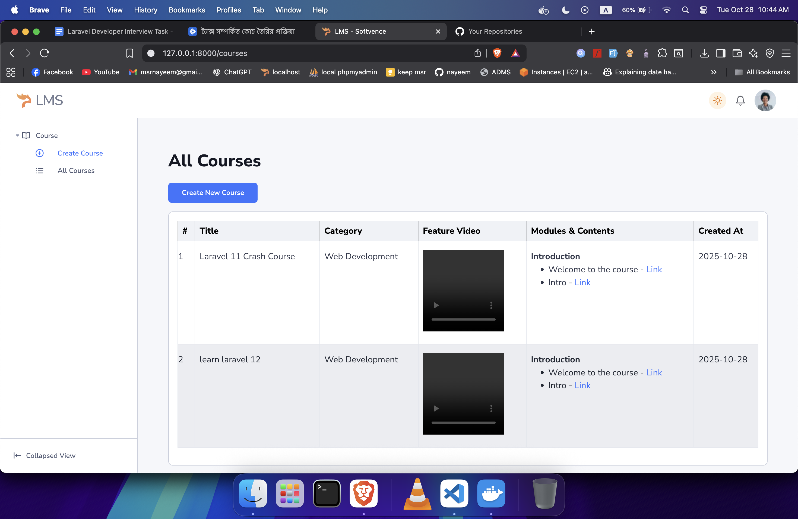

# 📚 Laravel Course Management System

A modern and scalable **Course Management System** built with **Laravel**, implementing **Service–Repository Architecture**, **Form Requests**, and **Bootstrap 5 UI**.
It allows you to create courses with **modules** and **contents (videos, links, etc.)**, and dynamically manage them with a clean, responsive interface.

---

## 🧰 Requirements

Before setting up the project, ensure your system meets the following:

| Requirement     | Recommended Version |
| --------------- | ----------------- |
| PHP             | ≥ 8.2             |
| Composer        | ≥ 2.5             |
| Node.js         | ≥ 18.x            |
| NPM             | ≥ 9.x             |
| Laravel         | 12.x or later     |
| MySQL / MariaDB | ≥ 5.7             |
| Git             | Latest            |

Optional:

* VS Code or PHPStorm (for development)
* Laravel Valet / XAMPP / Docker (for local environment)

**composer.json**:

```json
{
    "$schema": "https://getcomposer.org/schema.json",
    "name": "laravel/laravel",
    "type": "project",
    "description": "The skeleton application for the Laravel framework.",
    "keywords": ["laravel", "framework"],
    "license": "MIT",
    "require": {
        "php": "^8.2",
        "laravel/framework": "^12.0",
        "laravel/tinker": "^2.10.1"
    },
    "require-dev": {
        "fakerphp/faker": "^1.23",
        "laravel/pail": "^1.2.2",
        "laravel/pint": "^1.13",
        "laravel/sail": "^1.41",
        "mockery/mockery": "^1.6",
        "nunomaduro/collision": "^8.6",
        "phpunit/phpunit": "^11.5.3"
    }
}
````

**package.json**:

```json
{
    "$schema": "https://json.schemastore.org/package.json",
    "private": true,
    "type": "module",
    "scripts": {
        "build": "vite build",
        "dev": "vite"
    },
    "devDependencies": {
        "@tailwindcss/vite": "^4.0.0",
        "axios": "^1.8.2",
        "concurrently": "^9.0.1",
        "laravel-vite-plugin": "^1.2.0",
        "tailwindcss": "^4.0.0",
        "vite": "^6.2.4"
    }
}
```

---

## ⚙️ Installation Guide

Follow these steps to set up the project on a new PC:

### 1️⃣ Clone the Repository

```bash
git clone https://github.com/msrnayeem/lms-softvence.git
cd lms-softvence
```

### 2️⃣ Install PHP Dependencies

```bash
composer install
```

### 3️⃣ Install Frontend Dependencies

```bash
npm install
```

### 4️⃣ Create Environment File

Copy `.env.example` and rename to `.env`

```bash
cp .env.example .env
```

### 5️⃣ Generate Application Key

```bash
php artisan key:generate
```

### 6️⃣ Configure Database

Open `.env` and set your local database credentials:

```dotenv
DB_CONNECTION=mysql
DB_HOST=127.0.0.1
DB_PORT=3306
DB_DATABASE=lms-softvence
DB_USERNAME=root
DB_PASSWORD=
```

### 7️⃣ Run Migrations & Seeders

```bash
php artisan migrate --seed
```

### 8️⃣ Link Storage

```bash
php artisan storage:link
```

### 9️⃣ Run Development Server

```bash
php artisan serve
```

Visit the app:
👉 [http://127.0.0.1:8000](http://127.0.0.1:8000)

---

## 🏗️ Project Architecture Overview

### 📁 Folder Structure

```
project-root/
│
├── app/
│   ├── Http/
│   │   ├── Controllers/
│   │   │   └── CourseController.php
│   │   ├── Requests/
│   │   │   └── StoreCourseRequest.php
│   ├── Models/
│   │   ├── Category.php
│   │   ├── Course.php
│   │   ├── Module.php
│   │   └── Content.php
│   ├── Services/
│   │   └── CourseService.php
│   ├── Repositories/
│   │   ├── CategoryRepository.php
│   │   ├── CourseRepository.php
│   │   ├── ModuleRepository.php
│   │   └── ContentRepository.php
├── database/
│   ├── migrations/
│   ├── seeders/
│   │   └── CategorySeeder.php
├── resources/
│   ├── views/
│   │   ├── layouts/
│   │   │   ├── app.blade.php                  # Main layout
│   │   │   └── includes/
│   │   │       ├── footer.blade.php
│   │   │       ├── head.blade.php
│   │   │       ├── rtl-handler.blade.php
│   │   │       ├── scripts.blade.php
│   │   │       ├── sidebar.blade.php
│   │   │       └── topbar.blade.php
│   │   └── courses/
│   │       ├── index.blade.php
│   │       └── create.blade.php
├── public/
│   ├── storage/
│   └── css, js, etc.
├── routes/
│   └── web.php
├── .env
├── composer.json
├── package.json
├── store.png
├── index.png
└── README.md

```

---

## 📸 Screenshots

### Store Page


### Index Page



---

## 🧩 Application Flow

### 1️⃣ Course Creation

* User clicks **“Create New Course”**
* Loads form from `resources/views/courses/create.blade.php`
* Modules & contents managed dynamically
* Form validated via `StoreCourseRequest`
* Data passed to `CourseService` → DB transaction → create course, modules, contents

### 2️⃣ Course Listing

* `resources/views/courses/index.blade.php`
* Shows course title, category, embedded video, modules & contents
* Uses `CourseService → CourseRepository`

---


## 👨‍💻 Author

**MD. Shahidur Rahman Nayeem**
💼 Laravel Developer | 🚀 SaaS Builder | 💡 Clean Architecture Enthusiast
📧 [msrnayeem@gmail.com](mailto:msrnayeem@gmail.com)
